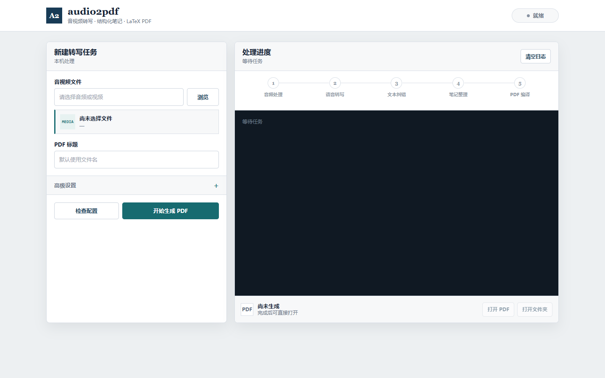

# audio2pdf

把本地音频或视频转换成带时间轴的中文 PDF：Groq Whisper 负责转写，DeepSeek 负责逐字稿纠错和结构化整理，XeLaTeX 负责编译。



## 功能

- 音频与视频输入：`mp3`、`wav`、`m4a`、`flac`、`mp4`、`mov`、`mkv` 等
- Groq `whisper-large-v3-turbo` 分片转写，长视频可断点续跑
- DeepSeek 分片纠错、缓存和自动重试
- 原文按真实音频切片时间分段，显示 `HH:MM:SS - HH:MM:SS`
- 稳定中文模板：`ctexart + Fandol + XeLaTeX`
- 输出整理笔记、原文逐字稿、`.tex`、运行日志和最终 PDF
- Windows 本地浏览器界面与命令行两种入口

## 快速开始

### 1. 安装环境

需要 Python 3.10+、FFmpeg（含 `ffprobe`）和 TeX Live（含 `xelatex`）。

```powershell
python -m pip install -r requirements.txt
```

### 2. 配置 API 密钥

不要把密钥写进仓库。Windows 下可写入用户环境变量：

```powershell
setx GROQ_API_KEY "你的 Groq API Key"
setx DEEPSEEK_API_KEY "你的 DeepSeek API Key"
```

`setx` 只对之后启动的进程生效。本项目也会从 Windows 用户环境变量注册表读取刚写入的值，因此配置检查无需重启电脑。

### 3. 一键打开

双击：

```text
start_audio2pdf_page.bat
```

页面只监听 `127.0.0.1`，音视频路径和处理过程不会暴露为公网服务。

## 命令行

检查本机工具与密钥：

```powershell
python main.py --check --require-api-keys
```

生成 PDF：

```powershell
python main.py "D:\recordings\lecture.mp4" --title "课程讲稿"
```

从失败的工作目录继续：

```powershell
python main.py "D:\recordings\lecture.mp4" `
  --resume-work-dir ".\output\_work_lecture_20260620-120000"
```

默认会自动查找同名输入的最近工作目录，复用转写结果和 DeepSeek 分片缓存。使用 `--no-resume` 可强制新建任务。

## 输出结构

```text
output/
├── lecture.pdf
└── _work_lecture_YYYYMMDD-HHMMSS/
    ├── raw_transcript.json
    ├── raw_transcript.txt
    ├── timestamped_transcript.txt
    ├── corrected_transcript.txt
    ├── organized_notes.md
    ├── deepseek_cache/
    ├── lecture.tex
    ├── lecture.log
    └── pipeline.log
```

`raw_transcript.json` 保存每个音频片段的真实起止秒数；PDF 原文部分直接使用这些时间，不由模型推测。

## 配置

复制 `config.example.yaml` 为 `config.yaml` 后按需修改：

- `transcription.chunk_minutes`：上传分片时长，默认 10 分钟
- `transcription.chunk_overlap_seconds`：相邻分片重叠，默认 3 秒
- `deepseek.proxy_mode`：`none` 忽略系统代理，`system` 使用系统代理
- `document.include_notes`：是否输出整理笔记
- `document.include_transcript`：是否输出带时间轴原文
- `output.resume_previous`：是否自动断点续跑

模板固定使用 TeX Live 自带的 Fandol 中文字体，避免依赖微软雅黑、宋体等系统字体导致乱码或无法编译。

## 项目结构

```text
audio2pdf/
├── main.py                  # 命令行入口
├── web_app.py               # 本地浏览器服务
├── start_audio2pdf_page.bat # Windows 一键入口
├── web/index.html           # 本地界面
├── src/
│   ├── pipeline.py
│   ├── audio_prep.py
│   ├── transcribe.py
│   ├── correct_and_organize.py
│   └── generate_pdf.py
├── templates/document.tex
├── tools/self_test_pdf.py
└── tests/
```

## 验证

```powershell
python -m unittest discover -s tests -v
python tools/self_test_pdf.py
```

PDF 自测会生成中文、特殊字符、目录和时间分段，用于检查 XeLaTeX 与字体环境。

## 安全

- `config.yaml`、`.env`、`output/` 和中间音频均由 `.gitignore` 排除。
- 本地页面不提供公网监听选项。
- 日志只显示密钥是否存在，不输出密钥内容。
